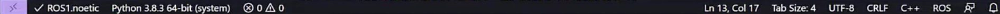
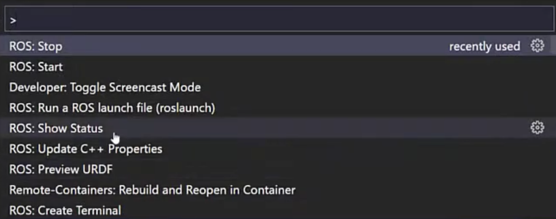
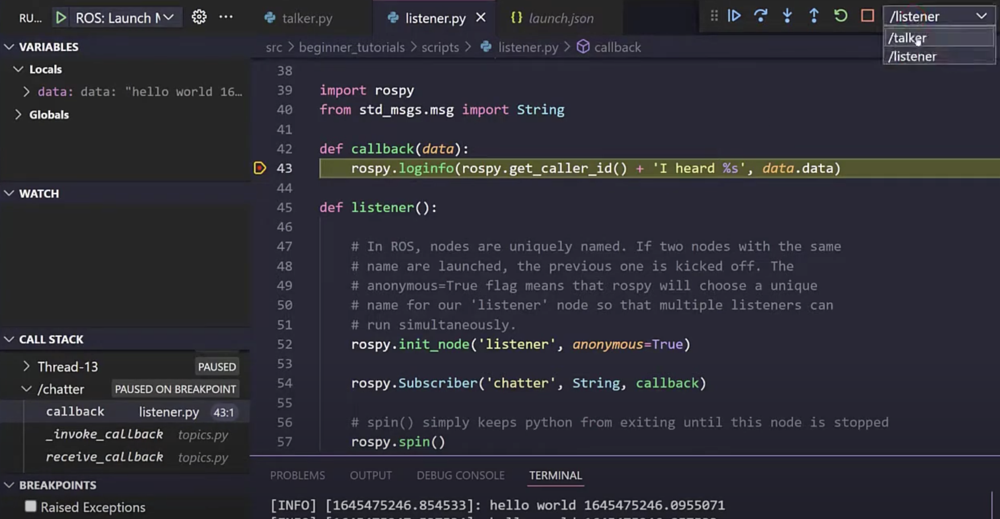

# VSCode-extensions
Simple installation of all VS code extensions for C++/Python development

## Installation

```bash
# Download Microsoft GPG key 🔑
sudo wget -q https://packages.microsoft.com/keys/microsoft.asc -O- | sudo gpg --dearmor -o /usr/share/keyrings/microsoft-archive-keyring.gpg

# Add the Visual Studio Code repository 📦
echo "deb [arch=arm64 signed-by=/usr/share/keyrings/microsoft-archive-keyring.gpg] https://packages.microsoft.com/repos/vscode stable main" | sudo tee /etc/apt/sources.list.d/vscode.list

# Update package list 🔄
sudo apt update

# Install Visual Studio Code ⚙️
sudo apt install code

# Download and install extensions 🛠️
git clone https://github.com/PiotrG1996/VSCode-extensions.git
cd VSCode-extensions/
chmod +x install-docker-and-vscode-extensions.sh 
./install-docker-and-vscode-extensions.sh
```

# Visual Studio Code Extensions

This script installs several Visual Studio Code extensions to enhance your development environment. Here's a list of the installed extensions with brief descriptions:

1. **Docker** - [ms-azuretools.vscode-docker](https://marketplace.visualstudio.com/items?itemName=ms-azuretools.vscode-docker)
   - Provides Docker integration, making it easier to manage containers.

2. **CMake Tools** - [ms-vscode.cmake-tools](https://marketplace.visualstudio.com/items?itemName=ms-vscode.cmake-tools)
   - Simplifies the CMake configuration process for C/C++ projects.

3. **Python** - [ms-python.python](https://marketplace.visualstudio.com/items?itemName=ms-python.python)
   - Offers rich Python language support and debugging capabilities.

4. **C/C++ Tools** - [ms-vscode.cpptools](https://marketplace.visualstudio.com/items?itemName=ms-vscode.cpptools)
   - Provides C/C++ language support, IntelliSense, and debugging features.

5. **ROS 2** - [nonanonno.vscode-ros2](https://marketplace.visualstudio.com/items?itemName=nonanonno.vscode-ros2)
   - Enhances the development of ROS 2 projects with support for ROS-specific features.

6. **Markdown All in One** - [yzhang.markdown-all-in-one](https://marketplace.visualstudio.com/items?itemName=yzhang.markdown-all-in-one)
   - Streamlines Markdown editing with various features like preview, table of contents, and more.

7. **YAML** - [redhat.vscode-yaml](https://marketplace.visualstudio.com/items?itemName=redhat.vscode-yaml)
   - Offers YAML language support and validation.

Please ensure that Visual Studio Code is installed before running the script to enjoy the benefits of these extensions.

For installation instructions, please refer to the script itself.


## 🔑 Step 1: Generate a New SSH Key

These instructions will guide you through the process of adding an SSH key to your system and configuring it for use with your new internet connection.

Follow these steps to manage SSH keys and connect to remote servers securely using SSH.

If you don't already have an SSH key pair, generate one using the following command in your terminal:

```bash
ssh-keygen -t rsa -b 4096 -C "your_email@example.com"
```
- ***```t rsa```*** - specifies the type of key to create (RSA in this case).
- ***```b 4096```*** - specifies the key length (4096 bits recommended for increased security).
- ***```C "your_email@example.com"```*** - Adds a comment to the key with your email address.

## 🔒 Step 2: Add SSH Key Using RSA Encryption

Start the SSH agent and add your SSH private key to the agent with the following commands:

```
eval $(ssh-agent)
ssh-add ~/.ssh/id_rsa
ssh-add -l
```

## 🚀 Step 3: Generate SSH Key Pair and Connect to Remote Host

Use your SSH private key to establish a connection with the remote server by running the following command:


```ssh -i ~/.ssh/id_rsa username@remote_server_ip```

Replace username with your username on the remote server and remote_server_ip with the IP address or hostname of the remote server.

## 🗝️ Step 4: Copy Public SSH Key to Server
Copy your SSH public key to the remote server for authentication using the ssh-copy-id command:


```ssh-copy-id username@remote_server_ip```

Follow the prompts to enter your password and securely copy your public key to the appropriate location on the remote server.

## 🌐 Step 5: Connect to Remote Host (After Adding SSH Key)
After adding your SSH key to the remote server, you can connect to the remote host using SSH without entering a password:

```ssh username@remote_server_ip```

You should now be able to establish a secure SSH connection to the remote server without the need for a password, using your SSH key pair for authentication.


## ROS settings for VS Code

```bash
# Set ROS environment variables 🌐
export ROS_DISTRO=neotic
export ROS_VERSION=1
export ROS_HOME="$HOME/ros"
export ROS_IP=127.0.0.1
export ROS_MASTER_URI=http://127.0.0.1:11311
export ROSPACKAGE_PATH=/opt/ros/noetic/share
export ROS_PYTHON_VERSION=3
export ROS_ROOT=/opt/ros/noetic/share/ros
```

## Using Command Palette in ROS Development with Visual Studio Code

In the context of ROS (Robot Operating System) development, the Command Palette in Visual Studio Code is a powerful tool that streamlines various actions and tasks. You can access the Command Palette by pressing *`Shift + Cmd + P`* (on macOS) or *`Shift + Ctrl + P`* (on Windows/Linux).



## Actions You Can Perform with the Command Palette

### 🤖 Run ROS Commands
Execute ROS-specific commands such as launching nodes, inspecting topics, configuring launch files, and managing ROS packages.

### 🧩 Access Extensions
Quickly install or manage Visual Studio Code extensions, including those tailored for ROS development (e.g., ROS language support, ROS-specific tools).

### ⚙️ Manage Settings
Modify editor settings and preferences to optimize your ROS development environment, such as adjusting syntax highlighting, indentation, and keybindings.

The Command Palette serves as a centralized hub for executing tasks efficiently and accessing essential functionalities within the ROS development context. Leverage these capabilities to enhance your productivity and streamline your workflow when working with ROS projects in Visual Studio Code.


### Example of command palette *```shift + cmd + p```*



### 🐞 Example of ROS Debug Configuration

To configure ROS debugging efficiently, follow these steps:


1. **Create a Debug Configuration File in JSON Format**:
   - Ensure that your ROS package contains an `example.launch` file, which is required for debugging.
   - Navigate to the debug section of your Visual Studio Code (VS Code) environment.

2. **Select Your ROS Package**:
   - Choose your ROS package within the debug section of VS Code.
   - This action will generate a JSON configuration file tailored to your ROS project.

3. **Start Debugging**:
   - With the JSON configuration file in place, you can now set breakpoints and debug multiple nodes simultaneously within your ROS environment.



# Simple docker startup project for ROS development

## Dockerfile
```bash
# Use a base image with Ubuntu 20.04 with the command:
# docker build -t ros_neotic.img .

FROM ros:noetic

# Set environment variables for ROS 1 Neotic
ENV ROS_DISTRO=neotic
ENV ROS_VERSION=1
ENV ROS_PYTHON_VERSION=3

RUN apt-get update && \
    apt-get install -y --no-install-recommends \
    gdb
ENTRYPOINT ["./ros_entrypoint.sh"]
CMD ["bash", "-c"]
```

## Docker-compose
```bash
# docker-compose up
# docker exec -it ros_neotic.img bash
version: '3'

services:
  ros_container:
    image: ros_neotic.img  # Use the image built from the updated Dockerfile
    container_name: ros_neotic
    environment:
      - ROS_DISTRO=neotic
      - ROS_MASTER_URI=http://my_master_ip:11311 
      - ROS_IP=my_ros_container_ip  
    network_mode: host  
    devices:
      - /dev/dri:/dev/dri  # Map GPU device (if needed)
    volumes:
      - ./Worksapce:/Workspace  # Mount local ROS workspace into the container
    command: bash -c "source /opt/ros/$ROS_DISTRO/setup.bash && roscore"

```

## Example of the workflow  

```plaintext
  +---------------------------------------------------+
  |                  Start                            |
  +---------------------------------------------------+
                          |
                          v
  +---------------------------------------------------+
  |        Open Visual Studio Code                    |
  +---------------------------------------------------+
                          |
                          v
  +---------------------------------------------------+
  |   Install "Remote - SSH" Extension                |
  +---------------------------------------------------+
                          |
                          v
  +---------------------------------------------------+
  |  Configure SSH Connection to Remote Machine       |
  +---------------------------------------------------+
                          |
                          v
  +---------------------------------------------------+
  |  Connect to Remote Machine using SSH              |
  +---------------------------------------------------+
                          |
                          v
  +---------------------------------------------------+
  |   Install "Remote - Containers" Extension         |
  +---------------------------------------------------+
                          |
                          v
  +---------------------------------------------------+
  |  Attach to Running Docker Container               |
  +---------------------------------------------------+
                          |
                          v
  +---------------------------------------------------+
  |  Develop Code inside Docker Container             |
  +---------------------------------------------------+
                          |
                          v
  +---------------------------------------------------+
  |  Access Container Terminal and File System        |
  +---------------------------------------------------+
                          |
                          v
  +---------------------------------------------------+
  |  Edit and Debug Code using VS Code                |
  +---------------------------------------------------+
                          |
                          v
  +---------------------------------------------------+
  |                     End                           |
  +---------------------------------------------------+

